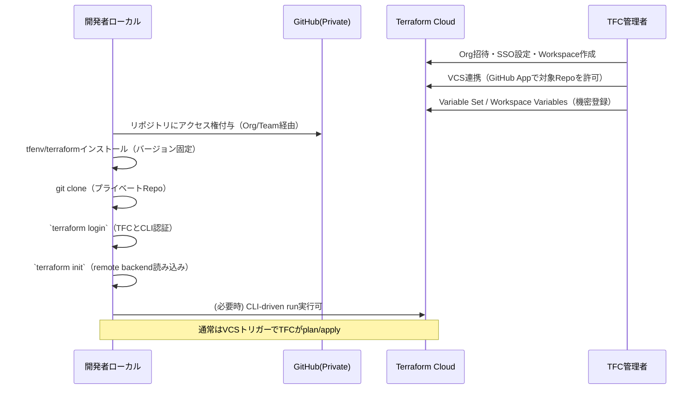
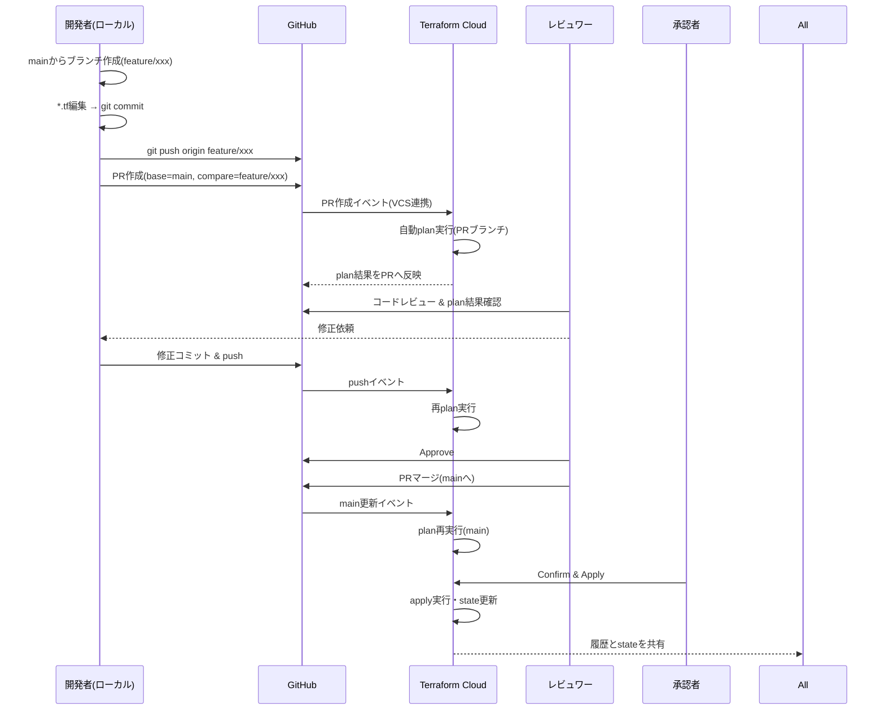
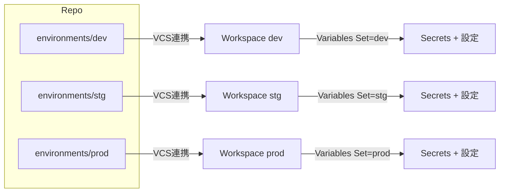
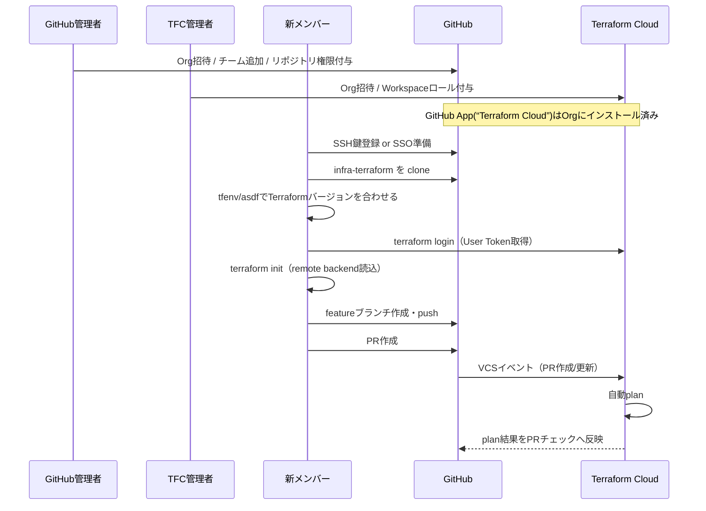

# 目的

- GitHub（プライベート）＋Terraform Cloud（以下 TFC）の**VCS連携**で、  
    ローカルは**最小権限**・**再現性あり**・**秘密情報を持たない**運用にする。
    

---

# 前提と役割

- **GitHub**: コード（`*.tf`・モジュール・README）。秘密は置かない。
    
- **TFC**: 実行（plan/apply）・state保管・Workspace Variables（機密含む）・ロール管理。
    
- **ローカルPC**: `terraform login`でTFCへ認証。実処理はTFCが実行。
    

---

# 権限モデル（最小権限の原則）

- **GitHub**: 開発者＝リポジトリ Read/Write（PR作成・レビュー・マージ）。
    
- **TFC**:
    
    - Viewer: Plan閲覧のみ
        
    - Plan: 手動Plan（必要な場合）
        
    - Apply: Confirm & Apply 権限
        
    - Admin: 変数・VCS・Workspace管理
        
- **原則**: Applyできる人を限定。Variables（特に機密）はAdmin/Approverが管理。
    

---

# 新規メンバーのオンボーディング（ローカルへ持ってくる流れ）

### ローカルの具体手順（開発者）

1. `git clone <private repo>`
    
2. `tfenv install <.terraform-version>` / `asdf terraform ...` などで**バージョン固定**
    
3. `terraform login`（TFCのUser Tokenを`~/.terraform.d/credentials.tfrc.json`へ保存）
    
4. `terraform init`（`backend "remote"`を読み込み、Workspaceに紐付け）
    
5. 通常は `terraform plan` をローカルで打つ必要はない（TFCがVCSイベントでplan）。
    

**ポイント**: ローカルには**秘密情報を置かない**。API鍵などは**TFC Variables**で一元管理。

---

# 日々の変更フロー（PRベース）

- **誰がApplyするか**をTFCのロールで制御。
    
- 監査性：**誰がいつ何をApplyしたか**がTFCに残る。
    

---

# 変数と機密の扱い（決め事）

- 機密（APIキー、クレデンシャル、DB接続文字列など）は**TFC Workspace Variables**または**Variable Sets**へ。
    
- GitHub Actions等と連携する場合も、**GitHub Secrets→TFC Variablesに渡す**設計を厳守。
    
- コード側は `var.xxx` 参照のみ。`*.tfvars` は**非機密のみ**（必要ならリポジトリ管理）。
    
- `terraform.tfstate` は**TFCにのみ存在**（ローカルへ出さない）。
    

---

# 環境分離（Workspaces/Branches）

代表パターン：

- **Workspace分割**: `dev` / `stg` / `prod` の各ワークスペース＋それぞれにVariable Setを割り当て。
    
- **ディレクトリ対応**: `environments/prod`, `.../stg` のようにコードを分け、TFCでWorking Directoryを指定。
    
- **ブランチ固定**: `prod`は`main`のみ、`stg`は`release/*`など**VCSブランチを固定**。
    

**ルール例**

- `prod`は**PRレビュー2名必須** + **Apply権限はSREのみ**。
    
- `dev`は自己承認OKでも、`prod`はTFCの**Manual Apply必須**を設定。
    

---

# 失敗時の扱い・ロールバック

- **Plan失敗**: PR修正→再push→自動再plan。
    
- **Apply失敗**: TFCのRunログで原因特定→修正PR→再Apply。
    
- **巻き戻し**:
    
    - 小規模：変更を戻すPR→Apply。
        
    - 大規模：**stateのPoint-in-time**を確認しつつ、コードで**逆変更**を当てる（stateの直接復元は最終手段）。
        

---

# ローカルで持つ設定は何か？

- **コード**：GitHubからclone（プライベートでもOK、権限付与済みを前提）。
    
- **Terraformバイナリ**：プロジェクトでバージョン固定（`.terraform-version` 等）。
    
- **認証情報**：`terraform login`で**TFCのUser Tokenのみ**（ローカルにクラウド鍵は置かない）。
    
- **バックエンド設定**：`backend "remote"`はリポジトリ内の`*.tf`で宣言。ローカルが読むのは**宣言だけ**。
    

---

# まとめ（要点）

- コードは**GitHub Private**、実行・state・秘密は**TFC**。
    
- 各自ローカルは**clone + terraform login + init**で再現可能。
    
- **PR→自動plan→承認→TFCでConfirm & Apply**の一方向フローを運用ルール化。
    
- 役割と権限を明確にし、**Applyの責任点**をTFC上に集約する。
    

この運用なら、「プライベートRepoから各自ローカルへ持ってきつつ、機密は一切ローカルに落とさず、チーム全体で安全に共有・適用」できます。

---

以下は、**「Terraform管理用プライベートリポジトリ」に新しいメンバーを安全に参加させるためのオンボーディング手順**です。  
GitHub（コード）と Terraform Cloud（実行・state）の両方で最小権限を守る前提で書いています。

# 1) 役割の切り分け（最小権限）

- **GitHub（コード）**
    
    - 読取のみ：閲覧・レビュー専用
        
    - 書込（Push/PR作成）：日常開発者
        
    - 管理（Admin/Maintain）：限定（ブランチ保護・Secret編集など）
        
- **Terraform Cloud（TFC｜実行・state）**
    
    - Viewer：Run/Plan結果閲覧のみ
        
    - Plan：手動Planまで
        
    - Apply：Confirm & Apply可（限定）
        
    - Admin：Workspace/Variables/連携設定
        

# 2) 新メンバー受け入れチェックリスト（管理者側）

**GitHub側**

-  GitHub Orgへ招待（SSOがある場合はSSO必須設定）
    
-  該当チームへ追加（例：`team-dev`）
    
-  Terraform管理用リポジトリ（例：`infra-terraform`）へ権限付与
    
    - 既に**チーム単位で付与**しているなら追加作業は「チームに入れるだけ」
        
    - 権限の目安：通常は **Write**（Push/PR可）、レビュー専任は **Triage/Read**
        
-  **ブランチ保護**が有効であることを確認
    
    - 例：`main` に Required reviews、必須ステータスチェック（TFC Plan 結果）等
        

**Terraform Cloud側**

-  TFC Orgへ招待（SSO/2FA確認）
    
-  Workspace権限を付与（Environment単位でロールを分ける）
    
    - 例：`dev=Plan or Apply 限定` / `stg=Plan` / `prod=Viewer or Apply限定者のみ`
        
-  Variables/Variable Setsは**閲覧不可**設定を維持（必要な人だけ編集可）
    

**VCS連携（TFC→GitHub）**

-  すでに**Orgにインストール済みの「Terraform Cloud」GitHub App**が対象Repoを読める状態か確認
    
    - 新メンバー個別設定は基本不要（AppはOrg単位）
        

# 3) 新メンバーのローカル初期設定（メンバー側）

1. **GitHubアクセス準備**
    

- GitHubアカウント作成＋**Org参加**
    
- 認証方式を決定
    
    - SSH鍵をGitHubに登録（推奨）
        
    - または HTTPS + SSO連携 +（必要なら）Fine-grained PAT
        
- `git clone git@github.com:org/infra-terraform.git`
    

2. **Terraform実行環境の揃え方**
    

- `tfenv` or `asdf` で **プロジェクト固定バージョン**を入れる（`.terraform-version` に従う）
    
- `terraform -version` で一致確認
    

3. **Terraform Cloud 認証**
    

- `terraform login` を実行（TFCのUser Tokenを取得し `~/.terraform.d/credentials.tfrc.json` に保存）
    
- `terraform init`（`backend "remote"` でWorkspaceに紐づく）
    

4. **日常作業フロー（PR前提）**
    

- `git checkout -b feature/xxxx`
    
- 変更 → `git add/commit` → `git push -u origin feature/xxxx`
    
- GitHubでPR作成（base=main, compare=feature/xxxx）
    
- PR作成/更新で **TFCが自動plan** → 結果をレビュー
    
- 承認後、`main`へマージ → **TFCが再plan** → **ApproverがConfirm & Apply**
    

# 4) Onboardingの流れ（Mermaid）

# 5) よくある質問（要点）

- **Q: 新メンバーはGitHub AppやPATを自分で設定する必要がある？**  
    A: いいえ。**TFC⇔GitHubの連携はOrgレベル**で完了済みが前提。新メンバーは**Org参加＋Repo権限**があればOK。ローカルでは `terraform login` のみ。
    
- **Q: 機密（APIキー等）はローカルに必要？**  
    A: 不要。**TFC Variables/Variable Sets**に保存。ローカルはTFCトークンのみ。
    
- **Q: 権限はどう割り当てる？**  
    A: GitHubは**チーム単位**付与、TFCは**Workspace×環境**でViewer/Plan/Applyを分離。`prod`はApplyを強く制限。
    

# 6) 最低限の運用ルール（抜粋）

- `main` は常に保護：Required reviews＋TFC plan チェック必須
    
- `prod` Workspace の Apply は指定ロールのみ（手動Confirm & Apply）
    
- GitHub/TFCとも**チーム単位**で権限管理（個別付与は例外時のみ）
    
- 機密は**リポジトリに置かない**（tfvars含む）。TFC Variablesで管理
    
- GitのPRフロー以外のApplyを禁止（CLI直Apply不可設定）
    

---

