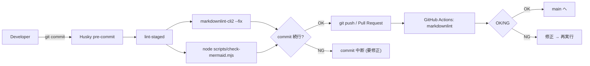

# コード検証パイプライン（Husky + GitHub Actions）

- 目的: Markdown と Mermaid の品質をコミット前とCIで二重担保する
- 範囲: ローカル pre-commit（Husky + lint-staged）と GitHub Actions（markdownlint）
- TL;DR: ローカルで自動修正＋構文検証を実施し、push/PRで再検証する

## 全体像（Mermaid）



## ローカル pre-commit（Husky 側）

- トリガ: `git commit` 実行時
- 実行: `lint-staged` がステージ済み `*.md` に対して以下を順に実行
  - `markdownlint-cli2 --fix` で自動修正とLintチェック
  - `node scripts/check-mermaid.mjs` で ```mermaid``` ブロックを構文検証（`mmdc` 利用）
- 成否: いずれかが失敗で commit を中断しエラー内容を表示
  - 成功時出力例: `Mermaid syntax OK: inputs (checked N block(s))`
  - 失敗時出力: ファイル別エラーと件数、終了コード非0
- 検証範囲: 基本はステージ済みファイル。引数なし実行時は `docs` 配下全体を走査

## CI（GitHub Actions 側）

- トリガ: `push` と `pull_request`（対象ブランチ: `main`）
- 条件: `**/*.md` と `.markdownlint.json` `.markdownlint-cli2.jsonc` の変更時のみ実行
- 実行環境: `ubuntu-latest` + Node `lts/*`
- ステップ: `actions/checkout` → `actions/setup-node` → `npx -y markdownlint-cli2 "**/*.md"`
- 成否: Lint成功で終了コード0、失敗で非0（PR上で赤表示）

## 運用メモ

- 目的: pre-commitで早期検出・自動修正、CIでレビューブロッカーとして最終保証
- 典型的失敗
  - Mermaidのタイポ/未閉じブロック/図形未定義
  - Markdownの見出し階層・リスト書式のLint指摘
- 修正指針: pre-commitのエラー箇所に従い再コミット。PR上のCI失敗は該当ファイルのLint修正で解消

## 拡張案（任意）

- CIでもMermaid構文検証を実行（`node scripts/check-mermaid.mjs docs`）し、ローカル差異をさらに低減
- `actions/setup-node` の `cache: npm` を利用して依存取得を高速化
- `paths` の見直しで、意図外の未実行/過剰実行を抑止
