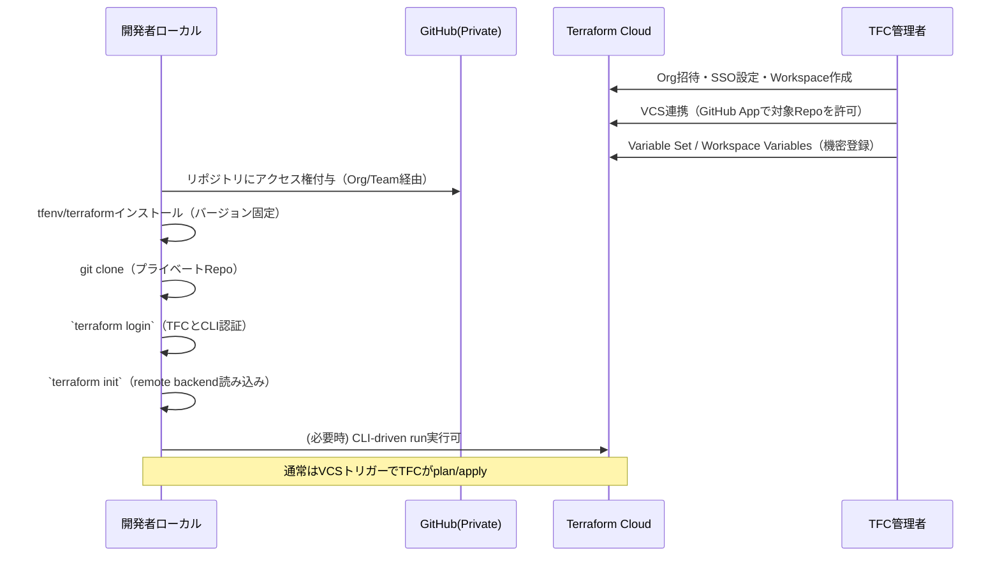
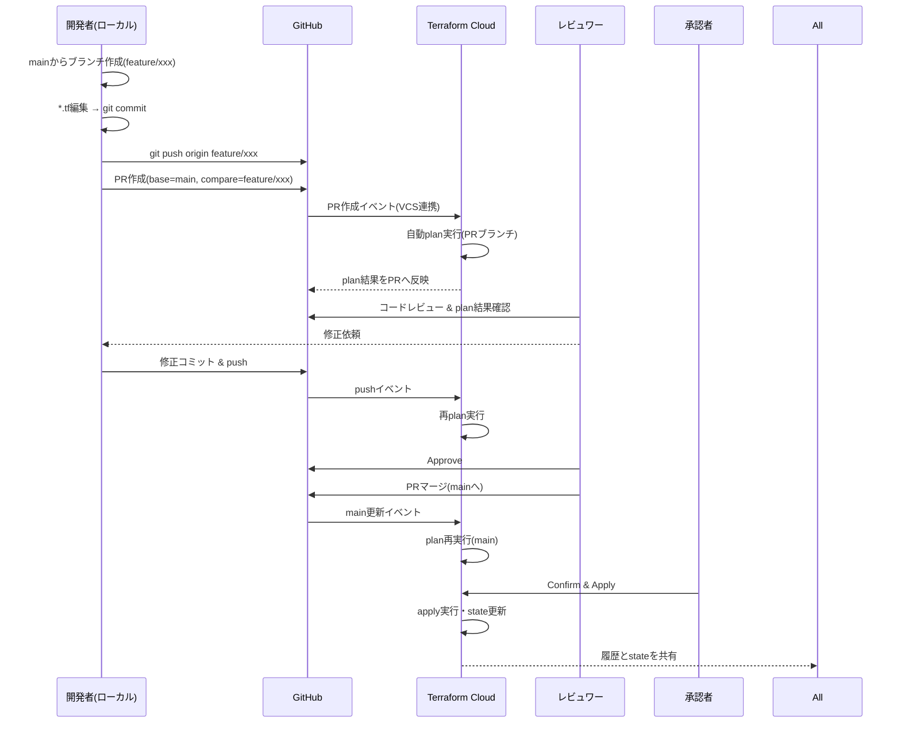
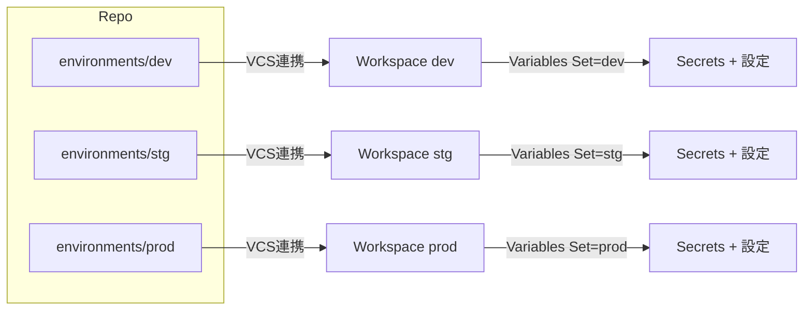

# GitHub（プライベート）× Terraform Cloud の VCS 連携

- 対象読者: GitHub Private Repo と TFC を連携して運用したいメンバー/管理者
- 前提条件: GitHub 組織権限（必要範囲）、TFC Org/Workspace 作成権限、ローカルの Terraform 実行環境
- TL;DR: コードはGitHub、実行/状態/秘密はTFCへ集約。VCS連携でPR起点のplan→承認→applyを実現し、ローカルは最小権限・秘密非保持とする。

## 目的

- GitHub（プライベート）＋Terraform Cloud（以下 TFC）の**VCS連携**で、
  ローカルは**最小権限**・**再現性あり**・**秘密情報を持たない**運用にする。

---

## 前提と役割

- **GitHub**: コード（`*.tf`・モジュール・README）。秘密は置かない。
- **TFC**: 実行（plan/apply）・state保管・Workspace Variables（機密含む）・ロール管理。
- **ローカルPC**: `terraform login`でTFCへ認証。実処理はTFCが実行。

---

## 権限モデル（最小権限の原則）

- **GitHub**: 開発者＝リポジトリ Read/Write（PR作成・レビュー・マージ）。
- **TFC**:
  - Viewer: Plan閲覧のみ
  - Plan: 手動Plan（必要な場合）
  - Apply: Confirm & Apply 権限
  - Admin: 変数・VCS・Workspace管理
- **原則**: Applyできる人を限定。Variables（特に機密）はAdmin/Approverが管理。

---

## 新規メンバーのオンボーディング（ローカルへ持ってくる流れ）

### ローカルの具体手順（開発者）

1. `git clone <private repo>`
2. `tfenv install <.terraform-version>` / `asdf terraform ...` などで**バージョン固定**
3. `terraform login`（TFCのUser Tokenを`~/.terraform.d/credentials.tfrc.json`へ保存）
4. `terraform init`（`backend "remote"`を読み込み、Workspaceに紐付け）
5. 通常は `terraform plan` をローカルで打つ必要はない（TFCがVCSイベントでplan）。

注意: ローカルには**秘密情報を置かない**。API鍵などは**TFC Variables**で一元管理。

---

## 日々の変更フロー（PRベース）

- **誰がApplyするか**をTFCのロールで制御。
- 監査性：**誰がいつ何をApplyしたか**がTFCに残る。

---

## 変数と機密の扱い（決め事）

- 機密（APIキー、クレデンシャル、DB接続文字列など）は**TFC Workspace Variables**または**Variable Sets**へ。
- GitHub Actions等と連携する場合も、**GitHub Secrets→TFC Variablesに渡す**設計を厳守。
- コード側は `var.xxx` 参照のみ。`*.tfvars` は**非機密のみ**（必要ならリポジトリ管理）。
- `terraform.tfstate` は**TFCにのみ存在**（ローカルへ出さない）。

---

## 環境分離（Workspaces/Branches）

代表パターン：

- **Workspace分割**: `dev` / `stg` / `prod` の各ワークスペース＋それぞれにVariable Setを割り当て。
- **ディレクトリ対応**: `environments/prod`, `.../stg` のようにコードを分け、TFCでWorking Directoryを指定。
- **ブランチ固定**: `prod`は`main`のみ、`stg`は`release/*`など**VCSブランチを固定**。

ルール例：

- `prod`は**PRレビュー2名必須** + **Apply権限はSREのみ**。
- `dev`は自己承認OKでも、`prod`はTFCの**Manual Apply必須**を設定。

---

## 失敗時の扱い・ロールバック

- **Plan失敗**: PR修正→再push→自動再plan。
- **Apply失敗**: TFCのRunログで原因特定→修正PR→再Apply。
- **巻き戻し**:
  - 小規模：変更を戻すPR→Apply。
  - 大規模：**stateのPoint-in-time**を確認しつつ、コードで**逆変更**を当てる（stateの直接復元は最終手段）。

---

## ローカルで持つ設定は何か？

- **コード**：GitHubからclone（プライベートでもOK、権限付与済みを前提）。
- **Terraformバイナリ**：プロジェクトでバージョン固定（`.terraform-version` 等）。
- **認証情報**：`terraform login`で**TFCのUser Tokenのみ**（ローカルにクラウド鍵は置かない）。
- **バックエンド設定**：`backend "remote"`はリポジトリ内の`*.tf`で宣言。ローカルが読むのは**宣言だけ**。

---

## まとめ（要点）

- コードはGitHub、実行/状態/秘密はTFC。
- PR駆動（VCS連携）で自動plan→レビュー→承認→apply。
- Apply権限と機密の管理をTFCへ集約し、最小権限で運用。

## 参考

- 後で公式ドキュメントリンクを追記予定。

