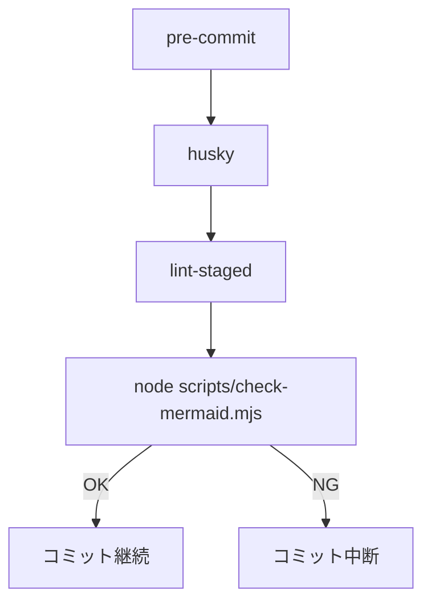
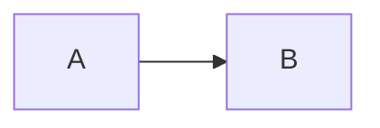

# docs 配下の Mermaid 構文チェック実装解説

## 目的

- docs 配下の Markdown/MDX に含まれる ```mermaid コードブロックの構文を自動検証する
- コミット前に失敗を検知し、エラーメッセージと行番号を表示して品質を担保する
- 実行場所は Git フック(pre-commit)。Husky 管理の `.husky/pre-commit` から起動する

## 全体像



## 実装構成

- ツール
  - Husky: Git フックを npm 管理
  - lint-staged: 変更ファイルを対象に検証
  - @mermaid-js/mermaid-cli(mmdc): Mermaid 構文の検証エンジン
  - fast-glob: docs 配下ファイル探索
- スクリプト
  - `scripts/check-mermaid.mjs`
  - 役割: Markdown/MDX から ```mermaid フェンスを抽出し、各ブロックを `mmdc` で検証

## 動作詳細

- 対象ファイル: `docs/**/*.{md,mdx}`
- 抽出規則: 開始が ```` ```mermaid``, 終了が ```` ``` ```` のフェンス
- 検証方式
  1. 各ブロックを一時 `.mmd` に出力
  2. `mmdc -i snippet.mmd -o snippet.svg --quiet` を実行
  3. 成功時は終了コード 0、失敗時は標準エラーから先頭行を採取
- 出力仕様
  - 成功: `Mermaid syntax OK: docs (checked N block(s))`
  - 失敗: `Mermaid syntax errors: M block(s) failed` に続き、`- <file> / L<line>: <message>` を列挙
  - 終了コード: 成功=0 / 失敗=1 / 例外=2

## 主要コードの要点

- ブロック抽出

```js
// 開始: ```mermaid または ```mermaid { ... }
if (!inBlock && /^```mermaid(\s|$)/.test(line)) { /* ... */ }
// 終了: ```
if (inBlock && /^```$/.test(line)) { /* ... */ }
```

- mmdc の解決

```js
// MERMAID_CLI 環境変数 > node_modules/.bin/mmdc を優先
function resolveMmdcPath() { /* ... */ }
```

- 成否出力

```js
if (errorCount === 0) {
  console.log(`Mermaid syntax OK: ${TARGET_DIR} (checked ${totalBlocks} block(s))`);
  process.exit(0);
} else {
  console.error(`Mermaid syntax errors: ${errorCount} block(s) failed`);
  // ファイル別に L<startLine>: <first error line> を出力
  process.exit(1);
}
```

## Git フック連携

- Husky 設定: `.husky/pre-commit`

```sh
npx --no-install lint-staged
# 全件検証に切替したい場合:
# npm run -s precommit:mermaid  # (= node scripts/check-mermaid.mjs docs)
```

- lint-staged 設計
  - 目的: 変更 Markdown のみ高速検証
  - 注意: JSON のキー重複は上書きとなる。`"*.md"` を2回書くと後勝ちになる
  - 推奨例(統合):

```json
{
  "lint-staged": {
    "*.md": [
      "markdownlint-cli2 --fix",
      "node scripts/check-mermaid.mjs",
      "git add"
    ]
  }
}
```

## 手動実行

- 全件検証: `node scripts/check-mermaid.mjs docs`
- 特定ディレクトリ: `node scripts/check-mermaid.mjs docs/guides`
- MERMAID_CLI を明示したい場合: `MERMAID_CLI=./node_modules/.bin/mmdc node scripts/check-mermaid.mjs docs`

## サンプル

- 正常



- エラー例(未定義方向) [注: 検証対象外のためフェンス名を変更]

```mermaid-err
flowchart LR
  A -=> B
```

期待: 失敗時に該当行番号とメッセージを出力してコミットを中断する

## トラブルシュート

- mmdc が見つからない
  - 対応: `npm i -D @mermaid-js/mermaid-cli` を確認。`npx mmdc -v` で動作確認
- すべてのファイルを検証して遅い
  - 対応: lint-staged を用いる。必要に応じ `check-mermaid.mjs` を拡張し、引数に渡されたファイルのみ検証する
- エラーメッセージが曖昧
  - 対応: 現実装は `stderr` 先頭行のみ採用。詳細は `MERMAID_CLI="mmdc --verbose"` 等で再現し個別調査
- MDX での特殊ケース
  - 対応: フェンスはプレーンな ```mermaid を推奨。入れ子や未クローズは検知不可の恐れ

## 既知の制限

- 抽出はフェンス記法のみ対象。インデントコードブロックや外部 .mmd ファイル参照は対象外
- Mermaid の初期化オプションは許容(例: ```mermaid { init: { 'theme': 'neutral' } } ) だが、構文は mmdc に依存
- 並列実行・キャッシュ最適化は未実装。大規模化時は導入を検討

## 改善提案

- lint-staged 引数対応
  - 受け取ったファイルリストから docs 配下の md/mdx のみ抽出し、その集合に限定して検証
- markdownlint 連携強化
  - `markdownlint-cli2 --fix` と Mermaid 検証を単一の `"*.md"` キーに統合して順序保証
- CI 連携
  - PR 時に docs 配下のみ検証する Workflow を追加し、ローカル未取得でも品質担保

## 検証方法

1. 正常サンプルとエラーサンプルを docs 配下に作成
2. `git add -A && git commit` を実行
3. 期待: エラー検出時はファイル/行を列挙し終了コード 非0 でコミット中断。修正後に再コミットで成功

## まとめ

- コミット前に Mermaid 構文を強制検証し、品質と可視性を担保する
- 実装は mmdc を用いたシンプル構成。Husky/lint-staged と組み合わせ、運用コストを最小化する
- 規模・要件に応じて引数対応や並列化、CI 連携を段階的に拡張する
